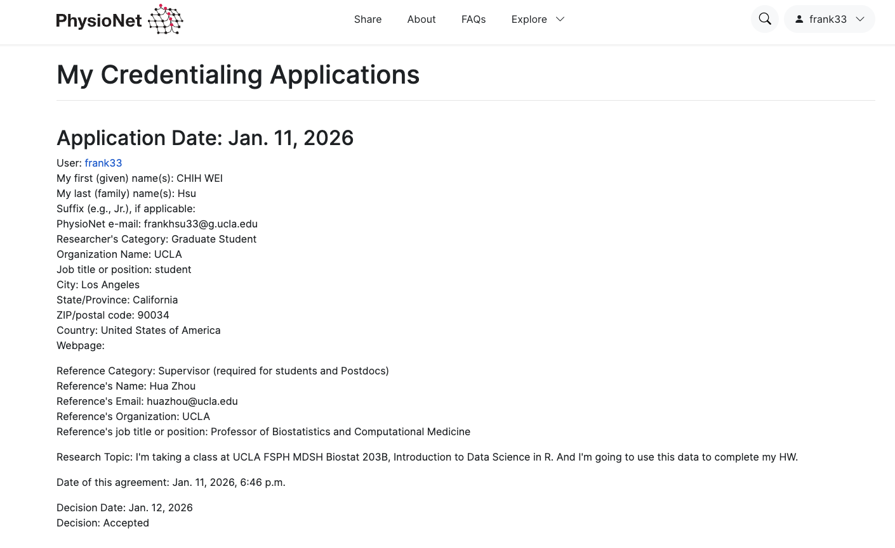
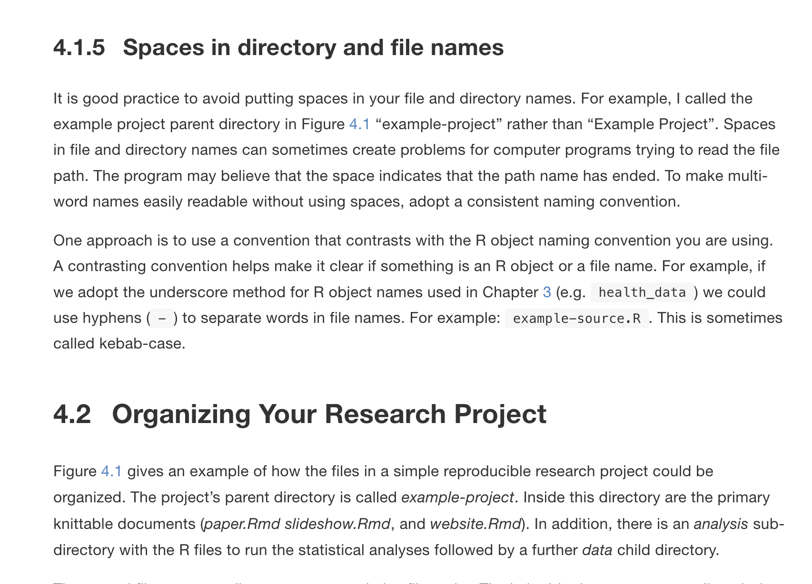

Display machine information for reproducibility:

```{r}
#| eval: true
sessionInfo()
```

## Q1. Git/GitHub

**No handwritten homework reports are accepted for this course.** We
work with Git and GitHub. Efficient and abundant use of Git, e.g.,
frequent and well-documented commits, is an important criterion for
grading your homework.

1.  Apply for the [Student Developer
    Pack](https://education.github.com/pack) at GitHub using your UCLA
    email. You'll get GitHub Pro account for free (unlimited public and
    private repositories).

2.  Create a **private** repository `biostat-203b-2026-winter` and add
    `Hua-Zhou` and TA team (`BowenZhang2001` for Lec 1; `Tomoki-Okuno`
    and `yucais` for Lec 82) as your collaborators with write
    permission.

3.  Top directories of the repository should be `hw1`, `hw2`, ...
    Maintain two branches `main` and `develop`. The `develop` branch
    will be your main playground, the place where you develop solution
    (code) to homework problems and write up report. The `main` branch
    will be your presentation area. Submit your homework files (Quarto
    file `qmd`, `html` file converted by Quarto, all code and extra data
    sets to reproduce results) in the `main` branch.

4.  After each homework due date, course reader and instructor will
    check out your `main` branch for grading. Tag each of your homework
    submissions with tag names `hw1`, `hw2`, ... Tagging time will be
    used as your submission time. That means if you tag your `hw1`
    submission after deadline, penalty points will be deducted for late
    submission.

5.  After this course, you can make this repository public and use it to
    demonstrate your skill sets on job market.

**Solution to Q1:I followed all the steps and created the repository
biostat-203b-2026-winter with required structure and collaborators.**

## Q2. Data ethics training

This exercise (and later in this course) uses the [MIMIC-IV data
v3.1](https://physionet.org/content/mimiciv/3.1/), a freely accessible
critical care database developed by the MIT Lab for Computational
Physiology. Follow the instructions at
<https://mimic.mit.edu/docs/gettingstarted/> to (1) complete the CITI
`Data or Specimens Only Research` course and (2) obtain the PhysioNet
credential for using the MIMIC-IV data. Display the verification links
to your completion report and completion certificate here. **You must
complete Q2 before working on the remaining questions.** (Hint: The CITI
training takes a few hours and the PhysioNet credentialing takes a
couple days; do not leave it to the last minute.)

<iframe src="citiCompletionReport.pdf" width="100%" height="700px"></iframe>



## Q3. Linux Shell Commands

1.  Make the MIMIC-IV v3.1 data available at location `~/mimic`. The
    output of the `ls -l ~/mimic` command should be similar to the below
    (from my laptop).

```{bash}
#| eval: true
# content of mimic folder
ls -l ~/mimic
```

Refer to the documentation <https://physionet.org/content/mimiciv/3.1/>
for details of data files. Do **not** put these data files into Git;
they are big. Do **not** copy them into your directory. Do **not**
decompress the gz data files. These create unnecessary big files and are
not big-data-friendly practices. Read from the data folder `~/mimic`
directly in following exercises.

Use Bash commands to answer following questions.

2.  Display the contents in the folders `hosp` and `icu` using Bash
    command `ls -l`. Why are these data files distributed as `.csv.gz`
    files instead of `.csv` (comma separated values) files? Read the
    page <https://mimic.mit.edu/docs/iv/> to understand what's in each
    folder.

**Solution to Q3.2:**

```{bash}
#| eval: true
# contents of hosp folder
ls -l ~/mimic/hosp
ls -l ~/mimic/icu
```

The data files are distributed as `.csv.gz` files instead of `.csv`
files to save storage space and reduce download time. Gzip compression
significantly reduces the file size, making it more efficient to store
and transfer large datasets. Additionally, working with compressed files
is a common practice in big data environments to minimize disk usage and
improve data handling efficiency.

3.  Briefly describe what Bash commands `zcat`, `zless`, `zmore`, and
    `zgrep` do.

```{bash}
#| eval: false
zcat< ~/mimic/hosp/labevents.csv.gz | head -10
```

**Solution to Q3.3:** - `zcat`: Outputs the contents of a
gzip-compressed file to standard output without uncompressing it to
disk. - `zless`: Similar to `zcat`+`less`, zless uses less to view the
contents of gzip-compressed files interactively. - `zmore`: Similar
to`zless`, displays the contents of a gzip-compressed file page by page
using more. - `zgrep`: search patterns in compressed files.

4.  (Looping in Bash) What's the output of the following bash script?

```{bash}
#| eval: false
for datafile in ~/mimic/hosp/{a,l,pa}*.gz
do
  ls -l $datafile
done
```

**Solution to Q3.4:** The output of the bash script lists the details
(permissions, number of links, owner, group, size, modification date,
and filename) of all files in the
`~/mimic/hosp/` directory that start
with 'a', 'l', or 'pa' and have a `.gz` extension.

Display the number of lines in each data file using a similar loop.
(Hint: combine linux commands `zcat <` and `wc -l`.)

```{bash}
#| eval: false
for datafile in ~/mimic/hosp/{a,l,pa}*.gz
do
  echo -n "$datafile: "
  zcat < $datafile | wc -l
done
```

5.  Display the first few lines of `admissions.csv.gz`. How many rows are in this data file, excluding the header line? 
```{bash}
#| eval: false
# Display first few lines of admissions.csv.gz
zcat < ~/mimic/hosp/admissions.csv.gz | head -5

```
```{bash}
#| eval: false
# Count number of rows excluding header
zmore < ~/mimic/hosp/admissions.csv.gz | tail -n +2 | wc -l
```
5-1. Each `hadm_id` identifies a hospitalization. How many hospitalizations are in this data file?
```{bash}
#| eval: false
# Count number of unique hadm_id
zcat < ~/mimic/hosp/admissions.csv.gz | 
tail -n +2 | 
awk -F, '{print $2}' |
sort | 
uniq |
wc -l
```
5-2. How many unique patients (identified by `subject_id`) are in this data file? 
```{bash}
#| eval: false
# Count number of unique subject_id
zcat < ~/mimic/hosp/admissions.csv.gz | 
tail -n +2 | 
awk -F, '{print $1}' |
sort | 
uniq | 
wc -l
```
5-3. Do they match the number of patients listed in the `patients.csv.gz` file? (Hint: combine Linux commands `zcat <`,
`head`/`tail`, `awk`, `sort`, `uniq`, `wc`, and so on.)
```{bash}
#| eval: false
# display first few lines of patients.csv.gz
zcat < ~/mimic/hosp/patients.csv.gz | head -5
```

```{bash}
#| eval: false
# Count number of unique subject_id in patients.csv.gz
zcat < ~/mimic/hosp/patients.csv.gz | 
tail -n +2 |
awk -F, '{print $1}' | 
sort | 
uniq | 
wc -l
```

**Solution to Q3.5:** - There are 546028 rows in the `admissions.csv.gz`
file, excluding the header line. - There are 546028 unique
hospitalizations (`hadm_id`) in this data file. - There are 223452
unique patients (`subject_id`) in this data file. -The number of unique
patients in `admissions.csv.gz` doesn't matches the number of patients
listed in the `patients.csv.gz` file, which is 364627.

6.  What are the possible values taken by each of the variable
    `admission_type`, `admission_location`, `insurance`, and
    `ethnicity`? Also report the count for each unique value of these
    variables in decreasing order. (Hint: combine Linux commands `zcat`,
    `head`/`tail`, `awk`, `uniq -c`, `wc`, `sort`, and so on; skip the
    header line.)
    
the possible values taken by "admission_type"
```{bash}
#| eval: True
zcat < ~/mimic/hosp/admissions.csv.gz| 
tail -n +2 |
awk -F, '{print $6}' | 
sort | 
uniq -c | 
sort -k 1 -n -r

```

7.  The `icusays.csv.gz` file contains all the ICU stays during the
    study period. How many ICU stays, identified by `stay_id`, are in
    this data file? How many unique patients, identified by
    `subject_id`, are in this data file?

```{bash}
#| eval: false
# display stay_id
zcat < ~/mimic/icu/icustays.csv.gz | head -5 
```

```{bash}
#| eval: false
# Count number of unique stay_id
zcat < ~/mimic/icu/icustays.csv.gz | 
tail -n +2 | 
awk -F, '{print $3}' |
sort | 
uniq | 
wc -l
# Count number of unique subject_id
zcat < ~/mimic/icu/icustays.csv.gz | 
tail -n +2 | 
awk -F, '{print $1}' | 
sort | 
uniq | 
wc -l
```

**Solution to Q3.7:** - There are 94458 unique ICU stays (`stay_id`)in
the `icusays.csv.gz` file. - There are 65366 unique
patients(`subject_id`) in the `icusays.csv.gz` file.

8.  *To compress, or not to compress. That's the question.* Let's focus
    on the big data file `labevents.csv.gz`. Compare compressed gz file
    size to the uncompressed file size. Compare the run times of
    `zcat < ~/mimic/labevents.csv.gz | wc -l` versus
    `wc -l labevents.csv`. Discuss the trade off between storage and
    speed for big data files. (Hint:
    `gzip -dk < FILENAME.gz > ./FILENAME`. Remember to delete the large
    `labevents.csv` file after the exercise.)

```{bash}
if [ -s labevents.csv ]; then
  echo "File labevents.csv exists in the current folder."
elif [ -s ~/mimic/hosp/labevents.csv ]; then
  echo "labevents.csv exists in ~/mimic/hosp folder."
  echo "Create a symbolic link."
  ln -s ~/mimic/hosp/labevents.csv labevents.csv
else
  time gzip -dk < ~/mimic/hosp/labevents.csv.gz > ./labevents.csv
fi
```

```{bash}
ls -l -L labevents.csv
```
count number of lines in the compressed file with `zcat` 
```{bash}
time zcat < ~/mimic/hosp/labevents.csv.gz | wc -l
```
count lines from the uncompressed file with `wc -l`
```{bash}
time wc -l labevents.csv
```


**Solution to Q3.8:** - The compressed `labevents.csv.gz` file is
significantly smaller than the uncompressed `labevents.csv` file, which
saves storage space. - The `zcat` command takes longer to execute
compared to reading the uncompressed file with `wc -l`, due to the
overhead of decompression. - The trade-off between storage and speed is
that while compressed files save disk space, they require additional
time to decompress when accessed, which can slow down data processing
tasks.

## Q4. Who's popular in Pride and Prejudice

1.  You and your friend just have finished reading *Pride and Prejudice*
    by Jane Austen. Among the four main characters in the book,
    Elizabeth, Jane, Lydia, and Darcy, your friend thinks that Darcy was
    the most mentioned. You, however, are certain it was Elizabeth.
    Obtain the full text of the novel from
    <http://www.gutenberg.org/cache/epub/42671/pg42671.txt> and save to
    your local folder.

```{bash}
#| eval: false
wget -nc http://www.gutenberg.org/cache/epub/42671/pg42671.txt
```

Explain what `wget -nc` does. Do **not** put this text file
`pg42671.txt` in Git. Complete the following loop to tabulate the number
of times each of the four characters is mentioned using Linux commands.

```{bash}
#| eval: false
wget -nc http://www.gutenberg.org/cache/epub/42671/pg42671.txt
for char in Elizabeth Jane Lydia Darcy
do
  echo $char:
  grep -o -i "$char" pg42671.txt | wc -l
done
```

**Solution to Q4.1:** The command `wget -nc` downloads the file from the
specified URL. The `-nc` option stands for "no clobber," which means
that if the file already exists in the local directory, `wget` will not
download it again, preventing overwriting of the existing file.

2.  What's the difference between the following two commands?

```{bash}
#| eval: false
echo 'hello, world' > test1.txt
```

and

```{bash}
#| eval: false
echo 'hello, world' >> test2.txt
```

**Solution to Q4.2:** - The first command
`echo 'hello, world' > test1.txt` creates a new file named `test1.txt`
and writes the string 'hello, world' into it. - The second command
`echo 'hello, world' >> test2.txt` appends the string 'hello, world' to
the end of the file named `test2.txt`. If `test2.txt` does not exist, it
will create a new file.

3.  Using your favorite text editor (e.g., `vi`), type the following and
    save the file as `middle.sh`:

```{bash eval=FALSE}
#!/bin/sh
# Select lines from the middle of a file.
# Usage: bash middle.sh filename end_line num_lines
head -n "$2" "$1" | tail -n "$3"
```

Using `chmod` to make the file executable by the owner, and run

```{bash}
#| eval: false
chmod u+x middle.sh
./middle.sh pg42671.txt 20 5
```

Explain the output. Explain the meaning of `"$1"`, `"$2"`, and `"$3"` in
this shell script. Why do we need the first line of the shell script?

**Solution to Q4.3:** The output of the command
`./middle.sh pg42671.txt 20 5` will display lines 16 to 20 of the file
`pg42671.txt`. The script works by first using `head -n "$2" "$1"` to
get the first 20 lines of the file (where `"$1"` is the filename
`pg42671.txt` and `"$2"` is the number 20). Then, it pipes this output
to `tail -n "$3"`, which extracts the last 5 lines from those 20 lines
(where `"$3"` is the number 5).

## Q5. More fun with Linux

Try following commands in Bash and interpret the results: `cal`,
`cal 2026`, `cal 9 1752` (anything unusual?), `date`, `hostname`,
`arch`, `uname -a`, `uptime`, `who am i`, `who`, `w`, `id`,
`last | head`, `echo {con,pre}{sent,fer}{s,ed}`, `time sleep 5`,
`history | tail`.

```{bash}
#| eval: false
# Try the following commands:
cal
cal 2026
cal 9 1752
date
hostname
arch
uname -a
uptime
who am i
who
w
id
last | head
echo {con,pre}{sent,fer}{s,ed}
time sleep 5
history | tail
```

**Solution to Q5:** - `cal`: Displays the current month's calendar. -
`cal 2026`: Displays the calendar for the year 2026. - `cal 9 1752`:
Displays the calendar for September 1752, which is unusual because it
only has 19 days due to the adoption of the Gregorian calendar. -
`date`: Displays the current date and time. - `hostname`: Displays the
name of the current host machine. - `arch`: Displays the architecture of
the machine (e.g., x86_64). - `uname -a`: Displays detailed information
about the system, including kernel version and architecture. - `uptime`:
Displays how long the system has been running along with the current
time and load averages. - `who am i`: Displays information about the
current user session. - `who`: Displays a list of all users currently
logged into the system. - `w`: Displays information about the current
users and their processes. - `id`: Displays the user ID and group ID of
the current user. - `last | head`: Displays the most recent logins to
the system, limited to the first few entries. -
`echo {con,pre}{sent,fer}{s,ed}`: Generates combinations of the words
"consents", "consented", "confers", "confered", "presents", "presented", "prefers", "prefered".
- `time sleep 5`: Measures the
time taken to execute the `sleep 5` command, which pauses for 5
seconds. - `history | tail`: Displays the last few commands executed in
the shell.

## Q6. Book

1.  Git clone the repository
    <https://github.com/christophergandrud/Rep-Res-Book> for the book
    *Reproducible Research with R and RStudio* to your local machine. Do
    **not** put this repository within your homework repository
    `biostat-203b-2026-winter`.

2.  Open the project by clicking `rep-res-3rd-edition.Rproj` and compile
    the book by clicking `Build Book` in the `Build` panel of RStudio.
    (Hint: I was able to build `git_book` and `epub_book` directly. For
    `pdf_book`, I needed to add a line `\usepackage{hyperref}` to the
    file `Rep-Res-Book/rep-res-3rd-edition/latex/preabmle.tex`.)

The point of this exercise is (1) to obtain the book for free and (2) to
see an example how a complicated project such as a book can be organized
in a reproducible way. Use `sudo apt install PKGNAME` to install
required Ubuntu packages and `tlmgr install PKGNAME` to install missing
TexLive packages.

For grading purpose, include a screenshot of Section 4.1.5 of the book
here.

```{r}
#| eval: true

```

## Q7. AI assistant

Which AI assistants (e.g., GitHub Copilot) do you use when working on
this assignment? Which AI model (e.g., GPT-5 mini, GPT-5, Claude Sonnet
4.5) does the AI assistant use? How do you use them? Do you think they
help improve your productivity?

**Solution to Q7.1:** I used GitHub Copilot, which utilizes the GPT-4
model, while working on this assignment. I primarily used it to generate
code snippets, suggest improvements to my existing code. Overall, I
found that using GitHub Copilot significantly improved my productivity
by speeding up the coding process and providing useful suggestions that
enhanced the quality of my work.

Give 5 instances where AI model gave incorrect or misleading answers.
You can use screenshots or copy-paste the Q&A.

**Solution to Q7.2:** 1. Sometimes the AI provides Docker commands even
though I am not always using Docker, which can be misleading in certain
situations.

2.  GitHub Copilot often gives incorrect answers. For example, when
    generating written responses, it sometimes produces incorrect or
    random numerical values.

3.  At the beginning of troubleshooting environment-related issues, I
    wanted to use Docker to write Linux commands, but the AI was unable
    to provide correct or appropriate environment setup instructions.

4.  The AI often provides answers that are not relevant to the actual
    question being asked.

5.  When I asked for specific code implementations, the AI sometimes
    generated code that did not align with best practices or was not
    optimized for performance.
